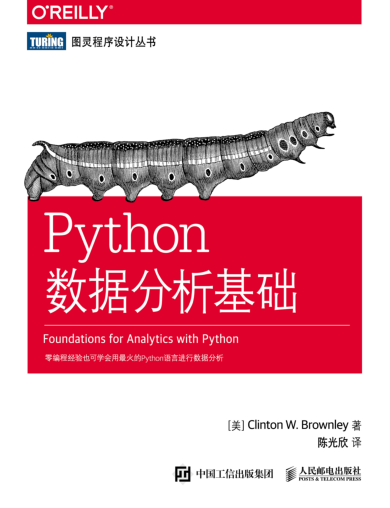

从今天（2018-3-13）到3月26号本目录下会更新《Python数据分析基础》这本书的一些读书笔记和思考。
## 书目信息：

原书名: Foundations for Analysis with Python
中文翻译版: Python数据分析基础
原作：Clinton W。Brownley
人民邮电出版社出版，2017年8月第一版。

本书关于基础知识的内容很多，作者也说：
> 本书面向的读者是那些经常使用电子表格软件进行数据处理，但从未写过一行代码的人。
因此对于数据的读入讲得比较多，重点讲了csv、Excel、SQL的读取与处理。关于一些建模和挖掘的算法讲得比较少。阅读完本书后会补充一些算法的内容（特别是关联分析和聚类的算法）。

### plan

- [x] Day 1 [第1章 Python基础_数据表示](./chpOnePyFoundation.ipynb)
- [x] Day 2 [第1章 Python基础_数据结构与文件读写](https://github.com/QLWeilcf/cunyu/blob/master/chpOneDataContainer.ipynb)
- [ ] Day 3 第2章 CSV文件
- [ ] Day 4 第3章 Excel文件
- [ ] Day 5 第4章 数据库_sqlite3学习与深入
- [ ] Day 6 第4章 数据库_MySQL
- [ ] Day 7 第5章 应用程序
- [ ] Day 8 第6章 图与图表_matplotlib
- [ ] Day 9 第6章 图与图表_其他可视化库
- [ ] Day 10 第7章 描述性统计建模
- [ ] Day 11 第8章 按计划自动运行脚本
- [ ] Day 12 第9章 从这里启航_更多模块和数据结构
- [ ] Day 13 关联分析_Apriori
- [ ] Day 14 关联分析_FP Tree  3月26号

#### 简书版

- [x] Day 1 [第1章 Python基础_数据表示](https://www.jianshu.com/p/00f763de8752)
- [x] Day 2 [第1章 Python基础_数据结构与文件读写](https://www.jianshu.com/p/d357d0e87a41)
- [ ] Day 3 第2章 CSV文件
- [ ] Day 4 第3章 Excel文件
- [ ] Day 5 第4章 数据库_sqlite3学习与深入
- [ ] Day 6 第4章 数据库_MySQL
- [ ] Day 7 第5章 应用程序
- [ ] Day 8 第6章 图与图表_matplotlib
- [ ] Day 9 第6章 图与图表_其他可视化库
- [ ] Day 10 第7章 描述性统计建模
- [ ] Day 11 第8章 按计划自动运行脚本
- [ ] Day 12 第9章 从这里启航_更多模块和数据结构
- [ ] Day 13 关联分析_Apriori
- [ ] Day 14 关联分析_FP Tree  3月26号

